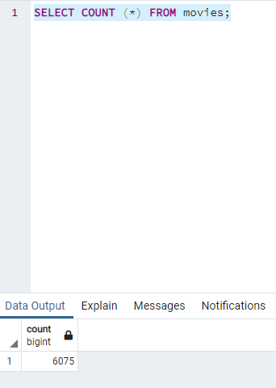
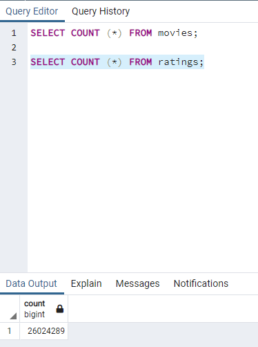

# Movies-ETL

This project is to use Python to clean and merge three large datasets: Kaggle metadata, Wikipedia data, and MovieLens rating data. Upon successful merger, the user can work on a clean and complete dataset with no duplicate columns, standardized format on information such as budget and release date, and more intuitive column names. The movies dataset and ratings dataset are also exported into SQL database for better prediction on popular release. 

This project also includes refactoring process on the original ETF process shown in the module. In particular, it introduced the use of try-except block.

Below are the results showing the count of rows on the two final databases:

**Movies row count**

**Ratings row count**

